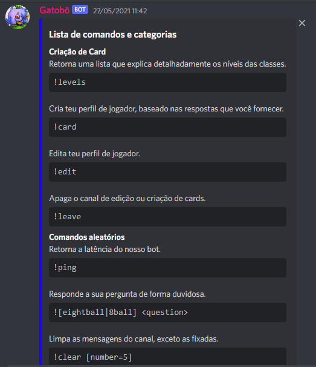
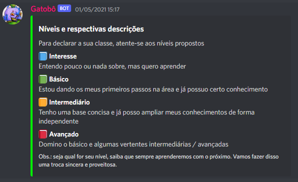
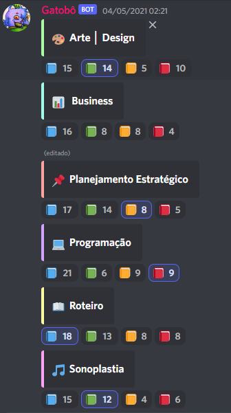
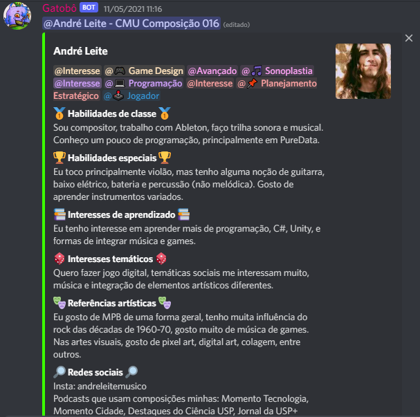
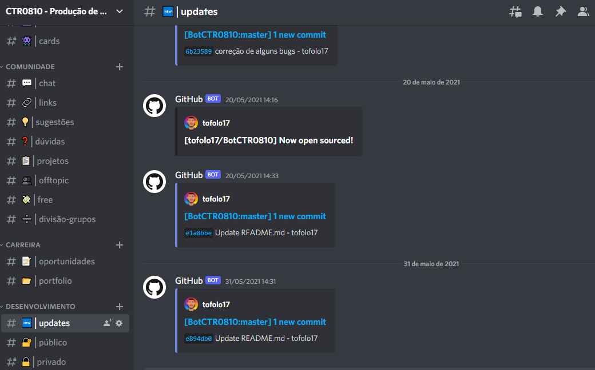
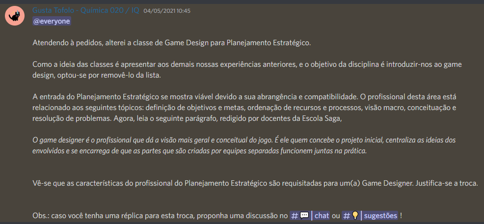

## O que você encontrará neste repositório?

Um bot Discord responsável pela criação de perfis pessoais e gamificação do servidor da
disciplina [CTR0810 (Produção de Games)](https://uspdigital.usp.br/jupiterweb/obterDisciplina?sgldis=CTR0810), turma 101-2021, ministrada
pelo professor [Gilson Schwartz](https://pt.wikipedia.org/wiki/Gilson_Schwartz).

## What will you find in this repository?

A Discord bot responsible for creating personal profiles and server gamification for the
course [CTR0810 (Games Production)](https://uspdigital.usp.br/jupiterweb/obterDisciplina?sgldis=CTR0810), class 101-2021, taught by
professor [Gilson Schwartz](https://pt.wikipedia.org/wiki/Gilson_Schwartz).

***

## A experiência resumida (_the experience in a nutshell_)

Mensagem de ajuda com todos os comandos do bot. Cada comando, por sua vez, possui uma mensagem específica.

_Help message with all the bot commands. Each command has a specific output._

    

 

Seção de atribuição de classes. É como se fosse um RPG: cada "jogador" tem suas "classes", com níveis de "força"
diferentes. Aqui, indicamos estes níveis.

_Class assignment section. It is like an RPG, each "player" has its "classes", with different "strength" levels. Here,
we indicate these levels._

    

 

Agora, definimos as "classes"!

_Now, we define the "classes"!_

    

 

Após a seleção de ao menos uma classe, é possível criar seu "card de jogador". Nele, você se apresenta como se fosse o
personagem de um game.

_After selecting at least one class, it is possible to create your "gamer card". In it, you present yourself as if you
were a character in a game._

    

 

Todas as atualizações do bot eram anunciadas publicamente através de um hook. Veja também, a organização do servidor.

_All bot updates were announced publicly via a hook. Check the server organization._

    

 

Por fim, um canal de sugestões!

_Finally, a suggestion channel!_

    

 
